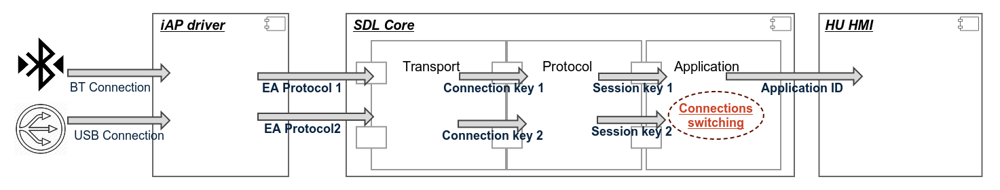
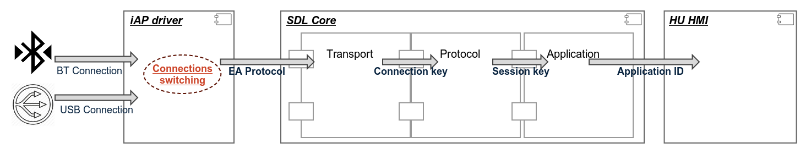
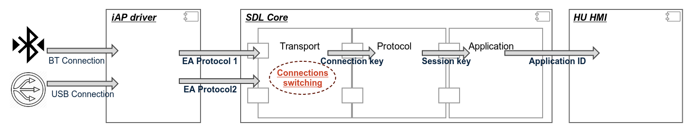
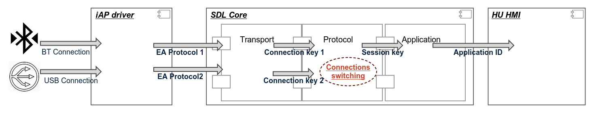

# Handling multiple connections to the same iOS device

* Proposal: [SDL-NNNN](nnnn-MultipleDeviceConnectionHandling.md)
* Author: [Elisey Zamakhov](https://github.com/pestOO)
* Status: **Awaiting review**
* Impacted Platforms: Mobile SDK, SDL Core

## Introduction

If the system detects multiple iAP sessions over different transports from the same iOS device, then the system shall continue the iAP session over the wired transport and shall disconnect the iAP session over the wireless transport.

## Motivation

The biggest concern for this feature is a possibility to minimize the impact for the user when an iOS device connected via BT is also connected via USB. Since Apple requires that only one transport should be connected (priority should be for wired transport) to the same device and since an iAP session over both transports are needed to determine if the same device is connected over both the transports, the head unit should be able to disconnect the app connection over the wireless transport and restore the connection back over the wired transport within a very short period of time – to provide a seamless experience to the user.

## Proposed solution

This solution provides ability to switch connection during new Application registration.
In case of Registering the same application from the same device it could be determined as the same application.
SDL core Application layer switches BT and USB connections due to Mobile Register Application Interface Request.
This switching is hidden for HMI.

***Pros:***

* Following SDL Protocol way with an Application responsibility for (re)connection to HU
* No additional iAP changes
* Could cover any type of device (ex. Android, iOS)
* Works for Android and other devices "Out-Of-Box"
* No Application disconnection for HMI side

***Cons:***

* The longest reconnection procedure, which mostly affects User reconnection experience (closer to a 1-2 second)
* A lot of SDL Core changes

## High-level design

## Impact on existing code

* iOS Mobile SDK
	* ***TBD***
* SDL Core - Transport layer
	* Adding timeouts for waiting device re-connection
	* Adding limitation for the outcome data during waiting timeout
	* Updating DeviceUpdate and ApplicationListUpdate notifications
* SDL Core - Protocol Handler
	* Secure session reestablishing for new session
	* Video and audio services reestablishing for new session
	* Update Heartbeat restricts (to avoid disconnection due to HB timeout)
	* Update Waiting Consecutive Frames timeout restricts (to avoid disconnection due to HB timeout)
* SDL Core - Application Manager
	* Implementation of connection switching mechanism
	* Update Waiting timeout for reconnecting procedure
* SDL Core - Policy
	* Updating *transportType* info
* SDL Core - Resumption
	* Updating device type information
* SDL Core - Security
	* Secure session reestablishing for new sessions

## Alternatives considered

Proposal contains 3 alternatives:

1. iAP driver changes without SDL changes
2. SDL Code Transport layer changes which requires iAP driver notification about the same device connection
3. SDL Core Protocol layer changes which requires Protocol specification extension

### Alternative #1 - iAP Driver Layer

Target head-unit provides an iAP (iPod Accessory Protocol) driver, which handles BT and USB iOS mobile device connections and encapsulates SDL-to-IAP connection within existing named EAP (External Accessory Protocol Strings).
iAP driver switches BT and USB connections.
This switching is hidden for SDL Core and HMI.

***Pros:***

* No SDL changes
* No Application disconnection for HMI side
* No Application disconnection on Application layer of SDL Core
* No Application disconnection on Protocol layer of SDL Core

***Cons:***

* Requires iAP driver update for each integrator
* Covers only one device type connection (iAP)

### Alternative #2 - SDL Core Transport layer changes

SDL can switch between transport connection due to integration system (transport drivers) events.
iAP drive still handles the same device connection and provides this information to the SDL Core.
SDL core Transport layer switches BT and USB connections.
This switching is hidden for upper (protocol and application) SDL Core levels and HMI.

***Pros:***

* No Application disconnection for HMI side
* No Application disconnection on Protocol layer of SDL Core
* Could cover any type of device (ex. Android, iOS)
* Could be delivered to Open-source as a template for further integration
* Could be integrated for Android, Windows Phone devices
* Could be integrated for new transport type (TCP/WiFi)

***Cons:***

* Require iAP driver notification about device re-connection
* Require SDL Core Transport Manager changes
* Bigger timeout which more affects User reconnection experience
* Dropping SDL-to-Mob data during waiting timeouts
* Risk of data loosing during Connection/disconnection (when data is already send to driver, but new connection is not established yet)

### Alternative #3 - SDL Core Protocol layer changes

Each re-connecting application could send a request for fast reconnection to SDL via a new type of transport.
It will require extending Ford Protocol specification with a new Control packets.
SDL core Protocol layer switches BT and USB connections due to Mobile request.
This switching is hidden for SDL Core application level and HMI.

***Pros:***

* Following SDL Protocol way with an Application responsible for (re)connection to HU
* Works for Android and other devices "Out-Of-Box"
* No additional iAP changes
* No Application disconnection on Application layer of SDL Core
* No Application disconnection on Protocol layer of SDL Core
* No Application disconnection for HMI side

***Cons:***

* Requires Ford Protocol Specification extension
* A lot of SDL Core changes
