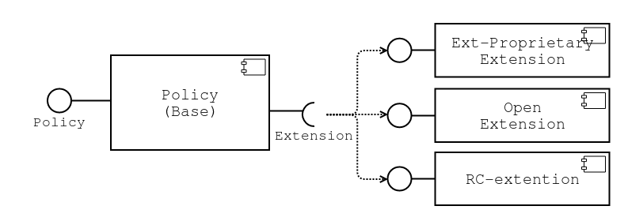

# Policy Module Design

* Proposal: [SDL-NNNN](nnnn-PolicyModuleDesign.md)
* Author: [Elisey Zamakhov](https://github.com/pestOO)
* Status: **Awaiting review**
* Impacted Platforms: Core

## Introduction

At this moment SDL Core has a list of SDL Policies with similar requirements and different code base:

* [OpenSource (O-S) Policy](https://github.com/smartdevicelink/sdl_core/tree/master/src/components/policy) - OpenSource Policy functionality
* [Ford-Specific (F-S) Policy ](https://github.com/CustomSDL/sdl_panasonic/tree/develop/src/components/policy) - Upgraded and improved Policy for SYNC3 integration
* *new* OpenSource External Proprietary (O-EP) - will be available in OpenSDL Core as a port of F-S Policy to open-source
* [RemoteControl (RC) Policy](https://github.com/CustomSDL/sdl_core/tree/master/src/components/policy) - extension for RemoteControl functionality

This proposal suggest a way to merge all (or at least most of) these Policies to one base source with a list of specific extensions.

*Note:* For further details about Policy component and dependencies please refer to [SAD - Component View](https://smartdevicelink.com/en/guides/core/software-architecture-document/components-view/).

## Motivation

Current approach with handling O-S, O-EP and RC- Policies as a separate source bases leads to double and triple design, implementation and bug-fixing for each code base.
Each bug-fixes, enchantments and improvements need to be applied to each source code: O-S, F-S, O-EP, RC.

## Proposed solution

SDL Core Policy functionality could be split to the following separate components with own area of responsibility

* **Base Policy**
* **Open Policy extension**
* **OpenSource External Proprietary Policy extension** (F-S ported to open-source)
* **Remote Control Policy extension**

* **Base Policy** provides list of interfaces for easy customer-specific integration and base Policy functionality:
  * Application behavior (RPC, heartbeat, hmi-types) management, authentication and revocation
  * Mobile RPC Permission management
  * Multiple persistent storage (DB, file, RAM)
  * Cloud PT Update, Retry seq
  * Preloaded PT 
  * Statistics
* **Extension** is a set of interfaces for each Policy Base feature add-on
* **Open Policy extension** - extends base with O-S only functionality:
  * SQlite Database
  * Extended (HTTP, PROPRIETARY) Policy Table update FLows
  * Open Policy Table update flow
* **O-EP Policy extension** (F-S ported to open-source) - provides F-S features and flows:
  * QDB Database
  * External proprietary Policy Table update FLow
  * Preloaded table merge
  * Customer Connectivity Settings (CSS)
  * Statistics extension
  * SDL, HMI, User settings persistence 
* **RC Policy extension** - RC-only extension
  * Driver/passenger mods 
  * RC-related groups

## Detailed design

* **Base Policy** component includes
  * External *Policy* interface with all Policy-related functionality
  * Application behavior management
  * *Extension interface* for Application behavior management
  * Base Mobile RPC Permission management
  * *Extension interface* for RPC management
  * *Extension interface* for new RPC and RPC-groups extension
  * Multiple persistent storage implementation
  * *Extension interface* for Persistence Storage integration to Specific API
  * Implements an *Extension interface* for SQLIte persistence storage
  * Cloud PT Update base mechanism
  * *Extension interface* for PT Update sequence extension
  * Base Statistics Tables and elements
  * *Extension interface* for new statistic fields handling
  * Preloaded PT loading from file logic
  * SDL, HMI, User settings persistence handling base logic
  * *Extension interface* for new setting handling
* **Open Policy extension** component
  * Implements an *Extension interface* for RPC management
  * Implements an *Extension interface* for HTTP PT Update sequence
  * Implements an *Extension interface* for PROPRIETARY PT Update sequence
* **OpenSource External Proprietary Policy extension** component
  * Implements an *Extension interface* for QDB persistence storage
  * Implements an *Extension interface* for External Proprietary PT Update sequence
  * Implements an *Extension interface* for CSS fields in restrict-groups
  * Implements an *Extension interface* for RPC-groups extension
  * Implements an *Extension interface* for HMI and User setting handling
* **RC Policy extension** component
  * Implements an *Extension interface* for RPC management
  * Implements an *Extension interface* for RPC-groups extension
  * Implements an *Extension interface* for new RPCs

## Impact on existing code

SDL Core:

* Update [**Application Manager**](https://smartdevicelink.com/en/guides/core/software-architecture-document/components-view/#application-manager) with new *Policy* using and loading
* Update [**Policy**](https://smartdevicelink.com/en/guides/core/software-architecture-document/components-view/#policy) - redesign and extracting base functionality
* Adding **Policy Extension** interfaces
* Adding **Policy Extension** components with *Extension interfaces* implementation

## Alternatives considered

Alternative solution is a list of separate O-S, F-S and RC Policies with own code base.
